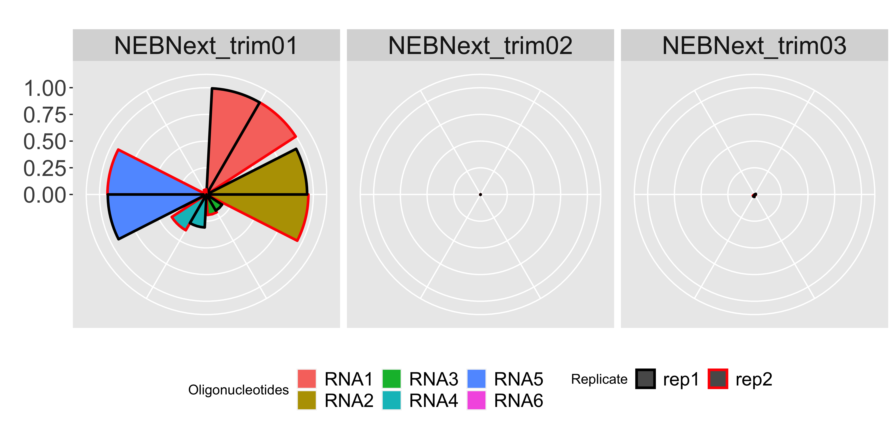
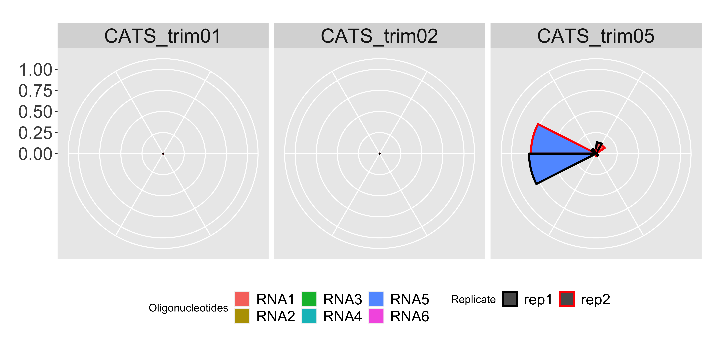
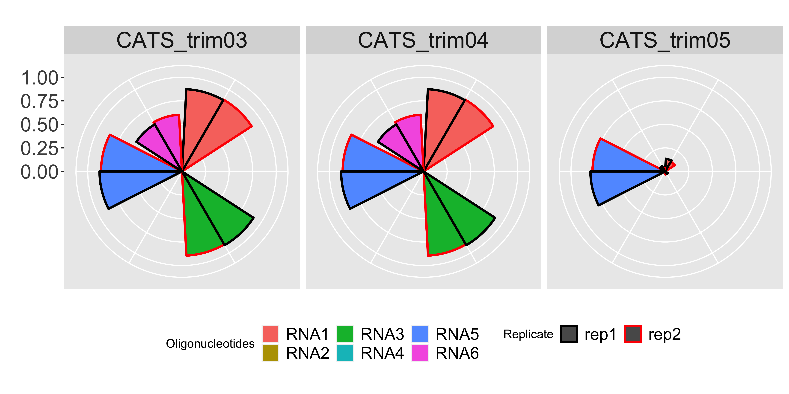

# DEMO analysis for importance of adapter sequence

#### Author: Xiangfu (Joey) Zhong

For more reproducibility and less dependency, this demo analysis only performed in command line (terminal, Unix/Linux).

Figures are plotting using R and Rstudio.

## Data Source 

Dard-Dascot, Cloelia, Delphine Naquin, Yves d’Aubenton-Carafa, Karine Alix, Claude Thermes, and Erwin van Dijk. "Systematic comparison of small RNA library preparation protocols for next-generation sequencing." BMC genomics 19, no. 1 (2018): 118. DOI: [https://doi.org/10.1186/s12864-018-4491-6](https://bmcgenomics.biomedcentral.com/articles/10.1186/s12864-018-4491-6) 


## Data Description
Dard-Dascot *et.al.* compared libraries prepared by different small RNA library preparation kits: TruSeq, NEXTflex V2, NEBNext, SMARTer and CATS. 

The prepared libraries were sequenced on NextSeq 500 platform by miRNA-Seq approach.

## Selected datasets for demo analysis

| Accession number | Kit | sample name | 
|:-----------:|:-----------:|:-----------:| 
| SRR6464616   | NEBNext| NN_synth_equi_rep2 |
| SRR6464623  | NEBNext| NN_synth_equi_rep1 |
| SRR6464673  | CATS | C_synth_equi_rep2 |
| SRR6464674  | CATS | C_synth_equi_rep1 |


## Analysis steps

#### downloading
Download dataset using `fastq-dump`

#### oligonucleotides in fasta
An `oligonucleotides.fa` was reconstructed from [`Additional file 12: Table S2 Oligonucleotides used in this study.`](https://bmcgenomics.biomedcentral.com/articles/10.1186/s12864-018-4491-6) in FASTA format. And **U** converted to **T**.

| Oligo Name | Oligonucleotides Sequence |
|-----------|-----------|
|RNA1|TGTGTTTGTGGAGATATGACATC|
|RNA2|AGATGGGACACCTTGTGACTAA|
|RNA3|GTCCTTCCAGATGTTCGTTAG|
|RNA4|TCCCTAAGGACCCACACGTTA|
|RNA5|TACAAATGTAGTGTATCCTT|
|RNA6|CCCATAATCCTAGTTATGG|


#### trimming adapter sequence
cutadapt v1.14 was used for adapter trimming. consistent with Dard-Dascot *et.al.*.
###### NEBNext samples
**NEBNext_trim01** Normally trimming with NEBNext adapter sequence `AGATCGGAAGAGCACACGTCT`
```console
cutadapt -a AGATCGGAAGAGCACACGTCT -o NEBNext_trim01_SRR6464616.fastq SRR6464616.fastq

cutadapt -a AGATCGGAAGAGCACACGTCT -o NEBNext_trim01_SRR6464623.fastq SRR6464623.fastq

```

**NEBNext_trim02** Trimming with additional A at 5' of NEBNext adapter
```console
cutadapt -a AAGATCGGAAGAGCACACGTCT -o NEBNext_trim02_SRR6464616.fastq SRR6464616.fastq

cutadapt -a AAGATCGGAAGAGCACACGTCT -o NEBNext_trim02_SRR6464623.fastq SRR6464623.fastq

```

**NEBNext_trim03** Trimming with CATS adapter `GATCGGAAGAGCACACGTCTG`
```console
cutadapt -a GATCGGAAGAGCACACGTCTG -o NEBNext_trim03_SRR6464616.fastq SRR6464616.fastq

cutadapt -a GATCGGAAGAGCACACGTCTG -o NEBNext_trim03_SRR6464623.fastq SRR6464623.fastq

```


###### CATS samples
**CATS_trim01** Normally trimming with CATS adapter sequence `GATCGGAAGAGCACACGTCTG`
```console
cutadapt -a  GATCGGAAGAGCACACGTCTG -o CATS_trim01_SRR6464673.fastq SRR6464673.fastq

cutadapt -a  GATCGGAAGAGCACACGTCTG -o CATS_trim01_SRR6464674.fastq SRR6464674.fastq

```

**CATS_trim02** trimming with NEBNext adapter sequence `AGATCGGAAGAGCACACGTCT`
```console
cutadapt -a  AGATCGGAAGAGCACACGTCT -o CATS_trim02_SRR6464673.fastq SRR6464673.fastq

cutadapt -a  AGATCGGAAGAGCACACGTCT -o CATS_trim02_SRR6464674.fastq SRR6464674.fastq

```

**CATS_trim03** CATS specific trimming --- version January2017
```console

cutadapt -u 3 SRR6464673.fastq | cutadapt -a AAAAAAAA - | cutadapt -a AAAAAAAN$ -a AAAAAAN$ -a AAAAAN$ - | cutadapt -a AGAGCACACGTCTG - | cutadapt -O 8 -g GTTCAGAGTTCTACAGTCCGACGATCNNN - | cutadapt -m 18 -o CATS_trim03_SRR6464673.fastq -


cutadapt -u 3 SRR6464674.fastq | cutadapt -a AAAAAAAA - | cutadapt -a AAAAAAAN$ -a AAAAAAN$ -a AAAAAN$ - | cutadapt -a AGAGCACACGTCTG - | cutadapt -O 8 -g GTTCAGAGTTCTACAGTCCGACGATCNNN - | cutadapt -m 18 -o CATS_trim03_SRR6464674.fastq -


```


**CATS_trim04** CATS specific trimming --- version March2017
```console
cutadapt -u 3 SRR6464673.fastq | cutadapt -a AAAAAAAA - | cutadapt -a AAAAAAAN$ -a AAAAAAN$ -a AAAAAN$ - | cutadapt -a AGAGCACACGTCTG - | cutadapt -O 8 -g GTTCAGAGTTCTACAGTCCGACGATCNNN - | cutadapt -m 18 -o CATS_trim04_SRR6464673.fastq -


cutadapt -u 3 SRR6464674.fastq | cutadapt -a AAAAAAAA - | cutadapt -a AAAAAAAN$ -a AAAAAAN$ -a AAAAAN$ - | cutadapt -a AGAGCACACGTCTG - | cutadapt -O 8 -g GTTCAGAGTTCTACAGTCCGACGATCNNN - | cutadapt -m 18 -o CATS_trim04_SRR6464674.fastq -


```


**CATS_trim05** CATS specific trimming --- version September2017
```console
cutadapt --trim-n -a GATCGGAAGAGCACACGTCTG -a AGAGCACACGTCTG SRR6464673.fastq | cutadapt -u 3 -a A{100} --no-indels -e 0.16666666666666666 - | cutadapt -O 8 --match-read-wildcards -g GTTCAGAGTTCTACAGTCCGACGATCSSS -m 18 -o CATS_trim05_SRR6464673.fastq -

cutadapt --trim-n -a GATCGGAAGAGCACACGTCTG -a AGAGCACACGTCTG SRR6464674.fastq | cutadapt -u 3 -a A{100} --no-indels -e 0.16666666666666666 - | cutadapt -O 8 --match-read-wildcards -g GTTCAGAGTTCTACAGTCCGACGATCSSS -m 18 -o CATS_trim05_SRR6464674.fastq -


```

**CATS_trim06** CATS specific trimming with additional A --- version September2017
```console
cutadapt --trim-n -a AGATCGGAAGAGCACACGTCTG -a AGAGCACACGTCTG SRR6464673.fastq | cutadapt -u 3 -a A{100} --no-indels -e 0.16666666666666666 - | cutadapt -O 8 --match-read-wildcards -g GTTCAGAGTTCTACAGTCCGACGATCSSS -m 18 -o CATS_trim06_SRR6464673.fastq -

cutadapt --trim-n -a AGATCGGAAGAGCACACGTCTG -a AGAGCACACGTCTG SRR6464674.fastq | cutadapt -u 3 -a A{100} --no-indels -e 0.16666666666666666 - | cutadapt -O 8 --match-read-wildcards -g GTTCAGAGTTCTACAGTCCGACGATCSSS -m 18 -o CATS_trim06_SRR6464674.fastq -


```

Counting reads in raw data
```console
grep "TGTGTTTGTGGAGATATGACATC" -c SRR*.fastq
grep "AGATGGGACACCTTGTGACTAA" -c SRR*.fastq
grep "GTCCTTCCAGATGTTCGTTAG" -c SRR*.fastq
grep "TCCCTAAGGACCCACACGTTA" -c SRR*.fastq
grep "TACAAATGTAGTGTATCCTT" -c SRR*.fastq
grep "CCCATAATCCTAGTTATGG" -c SRR*.fastq
```

Counting reads in trimmed data
```console
grep "^TGTGTTTGTGGAGATATGACATC$" -c *.fastq
grep "^AGATGGGACACCTTGTGACTAA$" -c *.fastq
grep "^GTCCTTCCAGATGTTCGTTAG$" -c *.fastq
grep "^TCCCTAAGGACCCACACGTTA$" -c *.fastq
grep "^TACAAATGTAGTGTATCCTT$" -c *.fastq
grep "^CCCATAATCCTAGTTATGG$" -c *.fastq

```

#### Wrap count into table

|FASTQ|trimming|RNA1|RNA2|RNA3|RNA4|RNA5|RNA6|
|:-----------|-----------|-----------:|-----------:|-----------:|-----------:|-----------:|-----------:|
|SRR6464616|RAW|           261372|21147|723|261|5953|21|
|SRR6464616|NEBNext_trim01|260260|20159|139|101|5512|1|
|SRR6464616|NEBNext_trim02|381|1|0|0|9|0|
|SRR6464616|NEBNext_trim03|224|244|0|5|5|0|
|SRR6464623|RAW|           214535|19227|975|262|7843|21|
|SRR6464623|NEBNext_trim01|213482|18106|170|81|7237|0|
|SRR6464623|NEBNext_trim02|421|5|2|1|8|0|
|SRR6464623|NEBNext_trim03|43|239|0|6|0|0|
|SRR6464673|RAW|        4121|13607|5574|4500|1427|209|
|SRR6464673|CATS_trim01|0|0|0|0|0|0|
|SRR6464673|CATS_trim02|0|0|0|0|0|0|
|SRR6464673|CATS_trim03|3630|5|4993|0|1226|126|
|SRR6464673|CATS_trim04|3630|5|4993|0|1226|126|
|SRR6464673|CATS_trim05|500|5|184|0|1101|8|
|SRR6464673|CATS_trim06|521|5|184|0|1096|18|
|SRR6464674|RAW|        5736|16502|7915|6689|2749|253|
|SRR6464674|CATS_trim01|0|0|0|0|0|0|
|SRR6464674|CATS_trim02|0|0|0|0|0|0|
|SRR6464674|CATS_trim03|5018|7|7161|0|2406|146|
|SRR6464674|CATS_trim04|5018|7|7161|0|2406|146|
|SRR6464674|CATS_trim05|780|7|241|0|2181|17|
|SRR6464674|CATS_trim06|804|7|241|0|2177|23|

#### ####  Plotting in R
```R
## load library 
library("ggplot2")
library("reshape")
## read in data  
countFilePath <- "/Users/xiangfuz/Documents/ngsProjects/adapter4srna/demoAnalysis/trimmedCount.csv"
trimmedCountDF <- read.delim(countFilePath, sep=';', header = TRUE )
## melt data frame 
trimmedCountDF <- melt(trimmedCountDF, id=c("FASTQ","Replicate", "trimming")) 
## ploting for each trimming
for(itrim in unique(trimmedCountDF$trimming)){
  itrimplot <- ggplot(trimmedCountDF[which(trimmedCountDF$trimming == itrim),], aes(x=variable, y=value, fill=variable)) + geom_bar(stat = "identity") +facet_grid(trimming ~ Replicate) +coord_polar() +xlab("") +ylab("") +theme(axis.text.x=element_blank(), legend.position = "bottom", axis.text.y = element_text(size=18), strip.text.x = element_text(size = 20), strip.text.y = element_text(size = 20), legend.text=element_text(size=15)) +scale_fill_discrete(name="Oligonucleotides") +ylim(0,1)
  png(gsub( ".csv", paste(".", itrim, ".png", sep=""), countFilePath), res = 500, units = 'in', width = 12, height = 7)
  print(itrimplot)
  dev.off()
}

```


## Methods
+ Since those four samples are sequenced on 6 oligonucleotides, RNA1-6. So, we use `grep` to count reads which contain the sequence of RNA1-6. Also to be simple, and reproducible. When `grep`ing in trimmed sample,  regular expression was used to count perfectly matched reads, such as `grep "^TGTGTTTGTGGAGATATGACATC$"`.
+ The yields of librayies prepared by different kits are varies. So we use *perfect trimmed percentage*, the number of `grep "MY_ADAPTER_SEQ"` in raw data / the number of `grep "^MY_ADAPTER_SEQ$"` in trimmed data, to compare trimming with different sequence. 

## Results
This demo analysis is focus on the effect of adapter sequence on trimming. We are aware of kit bias (varies detected count in librares prepared by different) and RNA bias (equimolar input of each RNAs, varied in detected count). 


### Correct adapter sequence is important
The first row is reads trimmed with proper NEBNext adapter sequence; the middle row is trimmed with additional A at 5’ end of NEBNext 3'adapter; the bottom row is trimmed with CATS adapter.  

+ NEBText_trim01: trimming with proper NEBNext adapter
+ NEBText_trim02: trimming with additional A at 5' end of NEBNext adapter
+ NEBText_trim03: trimming with removal A at 5' end and additional G at 3' of NEBNext adapter (identical to CATS adapter)

A correct adapter is significant. One nucleotide or two nucleotide can change quantification and mislead final conclusion. 



### Detailed trimming instruction is important
An adapter sequence is not adequate to get result because of specific modification in their library preparation protocol, such CATS, using poly(A) to reduce ligation bias. Without further detail parameter, merely adapter sequence could not trim reads properly. 

+ CATS_trim01: Normally trimming with CATS adapter sequence `GATCGGAAGAGCACACGTCTG` stated in CATS manual (version 2 | 09.17), same adapter sequence with *CATS_trim05*. 
+ CATS_trim02: trimming with NEBNext adapter sequence `AGATCGGAAGAGCACACGTCT`
+ CATS_trim05: trimming according to instruction in manual (version 2 | 09.17)




### Version of adapter sequence/trimming instruction should be clearly disclosed
CATS provides detailed trimming instruction in the manuals (Version 2 | 01.17, Version 2 | 03.17 and Version 2 | 09.17). However, the instruction stated differently between versions. 

+ CATS_trim03: trimming according to instruction in manual (version 2 | 01.17)
+ CATS_trim04: trimming according to instruction in manual (version 2 | 03.17)
+ CATS_trim05: trimming according to instruction in manual (version 2 | 09.17)

Minor difference observed in Tthe first two versions (*CATS_trim03* and *CATS_trim04*). However, *CATS_trim05* has remarkably variation to previous two. 

All three versions were not doog at RNA2 and RNA4 (because of these two RNAs end with A). 



Additional R codes for plotting figures in manuscript 
```R
png(gsub( ".csv", paste(".","NEBNext_trimming", ".png", sep=""), countFilePath), res = 500,units = 'in',width = 10, height = 7)
ggplot(trimmedCountDF[grepl("NEBNext", trimmedCountDF$trimming),], aes(x=variable, y=value, color = Replicate, fill=variable)) + geom_bar(position=position_dodge(), size=1, stat = "identity") +facet_grid(.~trimming) +coord_polar() +xlab("") +ylab("") +theme(axis.text.x=element_blank(), legend.position = "bottom", axis.text.y = element_text(size=18), strip.text.x = element_text(size = 20), strip.text.y = element_text(size = 20), legend.text=element_text(size=15)) +scale_fill_discrete(name="Oligonucleotides") +ylim(0,1) +scale_colour_manual(values=c("black", "red"))
dev.off()

png(gsub( ".csv", paste(".","CATS_trimming.1", ".png", sep=""), countFilePath), res = 500,units = 'in',width = 10, height = 7)
ggplot(trimmedCountDF[which(trimmedCountDF$trimming %in% c("CATS_trim01", "CATS_trim02", "CATS_trim03")),], aes(x=variable, y=value, color = Replicate, fill=variable)) + geom_bar(position=position_dodge(), size=1, stat = "identity") +facet_grid(.~trimming) +coord_polar() +xlab("") +ylab("") +theme(axis.text.x=element_blank(), legend.position = "bottom", axis.text.y = element_text(size=18), strip.text.x = element_text(size = 20), strip.text.y = element_text(size = 20), legend.text=element_text(size=15)) +scale_fill_discrete(name="Oligonucleotides") +ylim(0,1) +scale_colour_manual(values=c("black", "red"))
dev.off()

png(gsub( ".csv", paste(".","CATS_trimming.2", ".png", sep=""), countFilePath), res = 500,units = 'in',width = 10, height = 7)
ggplot(trimmedCountDF[which(trimmedCountDF$trimming %in% c("CATS_trim03", "CATS_trim04", "CATS_trim05")),], aes(x=variable, y=value, color = Replicate, fill=variable)) + geom_bar(position=position_dodge(), size=1, stat = "identity") +facet_grid(.~trimming) +coord_polar() +xlab("") +ylab("") +theme(axis.text.x=element_blank(), legend.position = "bottom", axis.text.y = element_text(size=18), strip.text.x = element_text(size = 20), strip.text.y = element_text(size = 20), legend.text=element_text(size=15)) +scale_fill_discrete(name="Oligonucleotides") +ylim(0,1) +scale_colour_manual(values=c("black", "red"))
dev.off()
```

